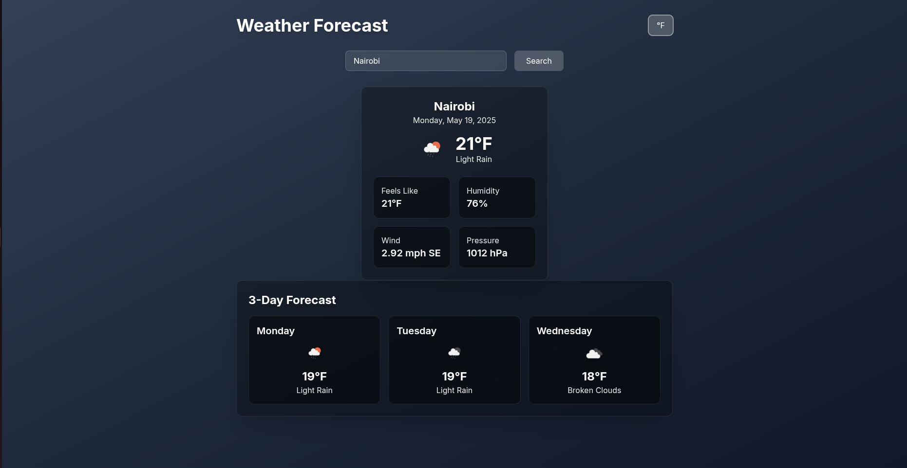

# Weather App

A modern, responsive weather application built with Next.js, Laravel, and the OpenWeatherMap API. This application provides real-time weather data and forecasts with a beautiful, user-friendly interface.

## Screenshots

### Main Weather View


### City Search


### Weather Forecast


### Unit Toggle


## Features

- 🌡️ Real-time weather data for any city worldwide
- 📅 3-day weather forecast
- 🔍 City search with autocomplete
- 🌡️ Temperature unit toggle (Celsius/Fahrenheit)
- 🎨 Dynamic background based on weather conditions
- 📱 Fully responsive design
- 🎯 Modern UI with glassmorphism effects

## Tech Stack

### Frontend
- Next.js 14.1.0
- TypeScript 5.3.3
- Tailwind CSS 3.4.1
- React Icons 5.0.1

### Backend
- Laravel 10.10.0
- PHP 8.2.0
- OpenWeatherMap API

## Prerequisites

### System Requirements
- Node.js v18.17.0 or higher
- PHP v8.2.0 or higher
- Composer 2.6.0 or higher
- OpenWeatherMap API key

### Required PHP Extensions
- BCMath PHP Extension
- Ctype PHP Extension
- cURL PHP Extension
- DOM PHP Extension
- Fileinfo PHP Extension
- JSON PHP Extension
- Mbstring PHP Extension
- OpenSSL PHP Extension
- PDO PHP Extension
- Tokenizer PHP Extension
- XML PHP Extension

## Installation

### 1. Clone the Repository
```bash
git clone https://github.com/yourusername/weather-app-next-lavarel.git
cd weather-app-next-lavarel
```

### 2. Backend Setup
```bash
cd backend

# Install PHP dependencies
composer install

# Create environment file
cp .env.example .env

# Generate application key
php artisan key:generate

# Add OpenWeatherMap API key
OPENWEATHER_API_KEY=your_api_key_here

# Start the Laravel development server
php artisan serve
```

### 3. Frontend Setup
```bash
cd frontend

# Install Node.js dependencies
npm install

# Create environment file
cp .env.example .env.local

# Configure API URL
# Edit .env.local file:
NEXT_PUBLIC_API_URL=http://localhost:8000/api

# Start the Next.js development server
npm run dev
```

The application will be available at:
- Frontend: http://localhost:3000
- Backend: http://localhost:8000

## API Endpoints

### Backend (Laravel)
- `GET /api/weather` - Get current weather data
  - Query Parameters:
    - `city` (required): City name
    - `units` (optional): 'metric' or 'imperial' (default: 'metric')
- `GET /api/forecast` - Get weather forecast
  - Query Parameters:
    - `city` (required): City name
    - `units` (optional): 'metric' or 'imperial' (default: 'metric')
- `GET /api/search` - Search for cities
  - Query Parameters:
    - `q` (required): Search query

### Frontend (Next.js)
- `GET /api/weather?city={city}&units={metric|imperial}` - Fetch weather data
- `GET /api/forecast?city={city}&units={metric|imperial}` - Fetch forecast data
- `GET /api/search?q={query}` - Search for cities

## Project Structure

```
weather-app-next-lavarel/
├── backend/                 # Laravel backend
│   ├── app/
│   │   ├── Http/
│   │   │   └── Controllers/
│   │   │       └── WeatherController.php
│   │   └── ...
│   ├── routes/
│   │   └── api.php
│   └── ...
├── frontend/                # Next.js frontend
│   ├── src/
│   │   ├── app/
│   │   │   └── page.tsx
│   │   ├── components/
│   │   │   ├── WeatherCard.tsx
│   │   │   └── Forecast.tsx
│   │   ├── lib/
│   │   │   └── api.ts
│   │   └── types/
│   │       └── weather.ts
│   └── ...
└── README.md
```

## Usage

1. Enter a city name in the search bar
2. Select a city from the suggestions
3. View current weather and 3-day forecast
4. Toggle between Celsius and Fahrenheit using the unit button

## Deployment

### Backend Deployment (Laravel)

1. Configure your production environment:
```bash
# Set production environment
APP_ENV=production
APP_DEBUG=false

# Generate application key if not already set
php artisan key:generate --force
```

2. Optimize the application:
```bash
# Clear configuration cache
php artisan config:cache

# Clear route cache
php artisan route:cache

# Clear view cache
php artisan view:cache
```

3. Set up your web server (Nginx example):
```nginx
server {
    listen 80;
    server_name your-domain.com;
    root /path/to/your/backend/public;

    add_header X-Frame-Options "SAMEORIGIN";
    add_header X-Content-Type-Options "nosniff";

    index index.php;

    charset utf-8;

    location / {
        try_files $uri $uri/ /index.php?$query_string;
    }

    location = /favicon.ico { access_log off; log_not_found off; }
    location = /robots.txt  { access_log off; log_not_found off; }

    error_page 404 /index.php;

    location ~ \.php$ {
        fastcgi_pass unix:/var/run/php/php8.2-fpm.sock;
        fastcgi_param SCRIPT_FILENAME $realpath_root$fastcgi_script_name;
        include fastcgi_params;
    }

    location ~ /\.(?!well-known).* {
        deny all;
    }
}
```

### Frontend Deployment (Next.js)

1. Build the application:
```bash
npm run build
```

2. Start the production server:
```bash
npm start
```

3. For production deployment, consider using:
- Vercel
- Netlify
- AWS Amplify
- DigitalOcean App Platform

## Troubleshooting

### Common Issues

1. **API Connection Issues**
   - Verify your OpenWeatherMap API key is correct
   - Check if the API key has the required permissions
   - Ensure the backend server is running

2. **Frontend Not Connecting to Backend**
   - Verify `NEXT_PUBLIC_API_URL` in frontend `.env.local`
   - Check CORS settings in Laravel backend
   - Ensure both servers are running

3. **Missing Dependencies**
   - Run `composer install` in backend directory
   - Run `npm install` in frontend directory
   - Check PHP extensions are installed

4. **Environment Configuration**
   - Ensure `.env` and `.env.local` files exist
   - Verify all required environment variables are set
   - Check file permissions

### Error Messages

1. **"API key not valid"**
   - Verify your OpenWeatherMap API key
   - Check if the key is properly set in `.env` file

2. **"CORS policy" errors**
   - Check Laravel CORS configuration
   - Verify API URL in frontend environment

## Contributing

1. Fork the repository
2. Create your feature branch (`git checkout -b feature/amazing-feature`)
3. Commit your changes (`git commit -m 'Add some amazing feature'`)
4. Push to the branch (`git push origin feature/amazing-feature`)
5. Open a Pull Request

## License

This project is licensed under the MIT License - see the [LICENSE](LICENSE) file for details.

## Acknowledgments

- [OpenWeatherMap](https://openweathermap.org/) for providing the weather data API
- [Next.js](https://nextjs.org/) for the frontend framework
- [Laravel](https://laravel.com/) for the backend framework
- [Tailwind CSS](https://tailwindcss.com/) for the styling framework 
